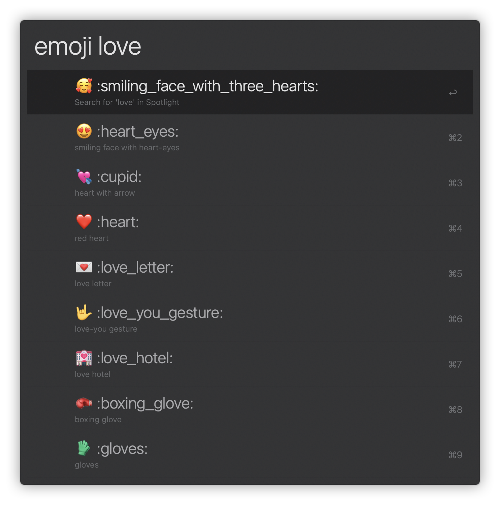

# 𝙞𝙛𝙪

𝘾𝙧𝙚𝙖𝙩𝙚 𝙬𝙤𝙧𝙠𝙛𝙡𝙤𝙬𝙨 𝙛𝙤𝙧 𝙚𝙢𝙤𝙟𝙞

[🍿️](/packages/popcron/README.md)[🕑](/packages/daydayup/README.md)[🌔](/packages/lunar/README.md) [🥰](/packages/emoji/README.md)

 

## For Developers

- [alfy](https://github.com/sindresorhus/alfy)
- [Script Filter JSON Format](https://www.alfredapp.com/help/workflows/inputs/script-filter/json/)
